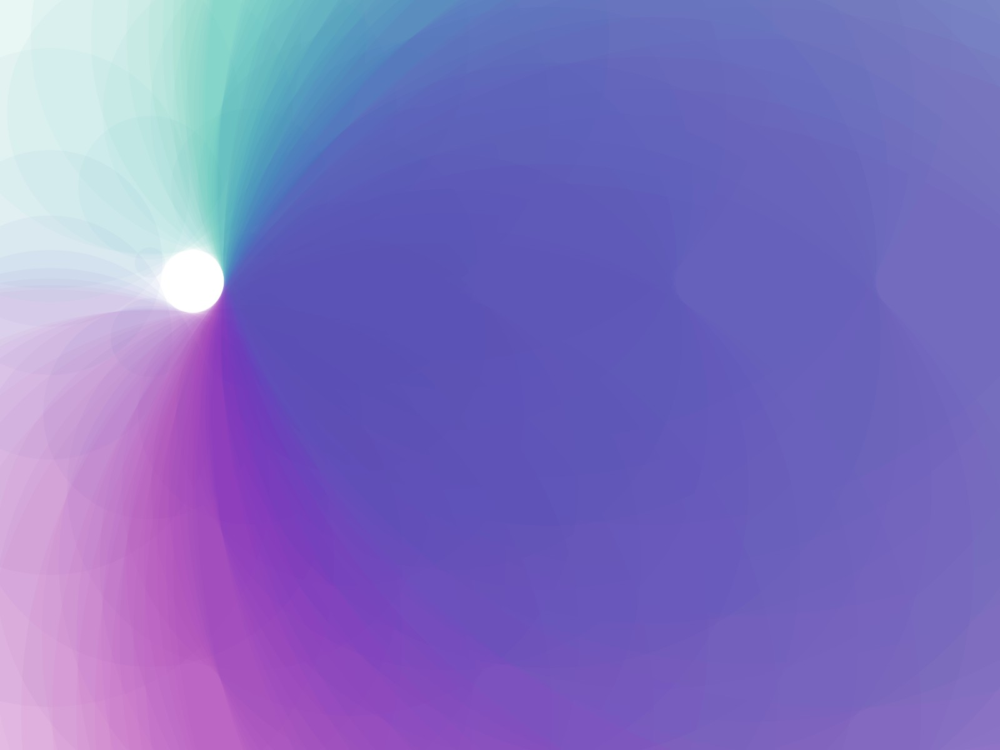

# Silksky

Processing experiment with circles and colors

The algorithm creates a grid of circles. The radius of the circles is equal to the distance between their center and the cursor minus a little value (radius of the sun).

:heart:
